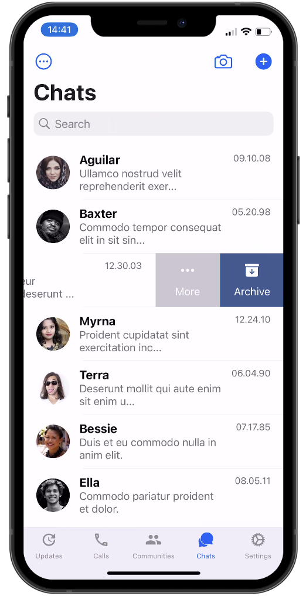
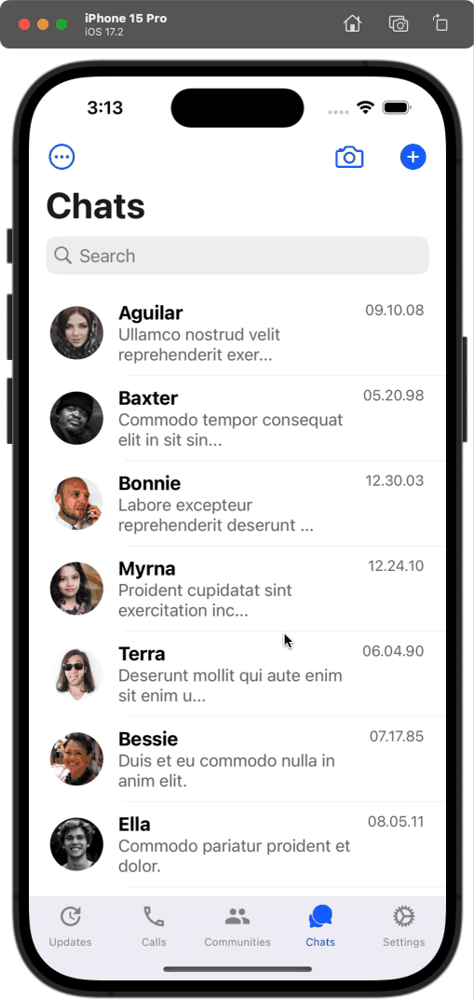

# React Native WhatsApp Clone with Clerk

This is a React Native WhatsApp clone using [Clerk](https://clerk.com/?utm_source=sponsorship&utm_medium=github&utm_campaign=simong&utm_content=rn-whatsapp) for user authentication with OTP.

Additional features:

- [Expo Router](https://docs.expo.dev/routing/introduction/) file-based navigation
- [SMS OTP](https://clerk.com/docs/custom-flows/email-sms-otp?utm_source=sponsorship&utm_medium=github&utm_campaign=simong&utm_content=rn-whatsapp) Auth with Clerk
- [Reanimated](https://docs.swmansion.com/react-native-reanimated/) 3 for animations
- [Gesture Handler](https://docs.swmansion.com/react-native-gesture-handler/) for gestures
- [Gifted Chat](https://github.com/FaridSafi/react-native-gifted-chat) for chat UI

## Screenshots

<div style="display: flex; flex-direction: 'row';">





</div>

## Demo

<div style="display: flex; flex-direction: 'row';">




</div>

### Prerequisites

- Node.js and npm installed on your machine.
- Expo CLI (if you don't have it, install it globally using `npm install -g expo-cli`)
- Make sure Android studio install in your local machine then using android emulator run app on your emulator.

## How to Start the Project

Follow these steps to run the Number Guess Games on your local machine:

1. **Clone the Repository**:
   Clone this repository to your local machine using the following command:

   ```bash
   git clone https://github.com/kabhinav577/react-native-whatsapp.git
   ```

2. Navigate to the Project Directory:

   ```
   cd react-native-whatsapp

   ```

3. Install Dependencies:

   ```
   npm install

   ```

4. Start the Development Server:

   ```
   npm start

   ```

5. Access the App:

   Download Expo go from play store and Scan **Expo Qr Code** from Expo go app.

## Authors

- [@krishna Kant singh](https://krishnakant-singh.vercel.app/)
